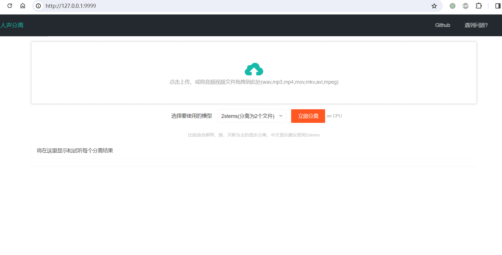

[English README](./README_EN.md) / [👑捐助该项目](https://github.com/jianchang512/pyvideotrans/blob/main/about.md) / [Discord](https://discord.gg/TMCM2PfHzQ) / Q群 608815898

# 音乐人声分离工具

这是一个极简的人声和背景音乐分离工具，本地化网页操作，无需连接外网，使用 2stems/4stems/5stems 模型。


> **[赞助商]** [302.AI](https://302.ai) 是一个汇集全球顶级AI的自助平台，按需付费，零月费，零门槛使用各种类型AI。
> [](https://302.ai/)
> [点击注册](https://302.ai): 立即获得 1PTC(1PTC=1美金，约为7人民币)代币。通过链接试用每天有5ptc额度
> **功能全面:** 将最好用的AI集成到在平台之上，包括不限于AI聊天，图片生成，图片处理，视频生成，全方位覆盖。
> **简单易用:** 提供机器人，工具和API多种使用方法，可以满足从小白到开发者多种角色的需求。
> **按需付费，零门槛:** 不提供月付套餐，对产品不设任何门槛，按需付费，全部开放。充值余额永久有效。
> **管理者和使用者分离：** 管理者一键分享，使用者无需登录。使用者无需关心复杂的AI设置，让懂AI的人来配置，简化使用流程。


> 
> 将一首歌曲或者含有背景音乐的音视频文件，拖拽到本地网页中，即可将其中的人声和音乐声分离为单独的音频wav文件，可选单独分离“钢琴声”、“贝斯声”、“鼓声”等
> 
> 自动调用本地浏览器打开本地网页，模型已内置，无需连接外网下载。
> 
> 支持视频(mp4/mov/mkv/avi/mpeg)和音频(mp3/wav)格式
> 
> 只需点两下鼠标，一选择音视频文件，二启动处理。
> 


# 视频演示

https://github.com/jianchang512/vocal-separate/assets/3378335/8e6b1b20-70d4-45e3-b106-268888fc0240





# 预编译Win版使用方法/Linux和Mac源码部署

1. [点击此处打开Releases页面下载](https://github.com/jianchang512/vocal-separate/releases)预编译文件

2. 下载后解压到某处，比如 E:/vocal-separate

3. 双击 start.exe ，等待自动打开浏览器窗口即可

4. 点击页面中的上传区域，在弹窗中找到想分离的音视频文件，或直接拖拽音频文件到上传区域，然后点击“立即分离”，稍等片刻，底部会显示每个分离文件以及播放控件，点击播放。

5. 如果机器拥有英伟达GPU，并正确配置了CUDA环境，将自动使用CUDA加速


# 源码部署(Linux/Mac/Window)

0. 要求 python 3.9->3.11

1. 创建空目录，比如 E:/vocal-separate, 在这个目录下打开 cmd 窗口，方法是地址栏中输入 `cmd`, 然后回车。

	使用git拉取源码到当前目录 ` git clone git@github.com:jianchang512/vocal-separate.git . `

2. 创建虚拟环境 `python -m venv venv`

3. 激活环境，win下命令 `%cd%/venv/scripts/activate`，linux和Mac下命令 `source ./venv/bin/activate`

4. 安装依赖: `pip install -r requirements.txt`

5. win下解压 ffmpeg.7z，将其中的`ffmpeg.exe`和`ffprobe.exe`放在项目目录下, linux和mac 到 [ffmpeg官网](https://ffmpeg.org/download.html)下载对应版本ffmpeg，解压其中的`ffmpeg`和`ffprobe`二进制程序放到项目根目录下

6. [下载模型压缩包](https://github.com/jianchang512/vocal-separate/releases/download/0.0/models-all.7z)，在项目根目录下的 `pretrained_models` 文件夹中解压，解压后，`pretrained_models`中将有3个文件夹，分别是`2stems`/`3stems`/`5stems`

7. 执行  `python  start.py `，等待自动打开本地浏览器窗口。


# API 接口

接口地址: http://127.0.0.1:9999/api

请求方法: POST

请求参数:

    file: 要分离的音视频文件

    model: 模型名称 2stems,4stems,5stems

返回响应: json
    code:int, 0 处理成功完成，>0 出错

    msg:str,  出错时填充错误信息

    data: List[str], 每个分离后的wav url地址，例如 ['http://127.0.0.1:9999/static/files/2/accompaniment.wav']

    status_text: dict[str,str], 每个分离后wav文件的包含信息,{'accompaniment': '伴奏', 'bass': '低音', 'drums': '鼓', 'other': '其他', 'piano': '琴', 'vocals': '人声'}

```
import requests
# 请求地址
url = "http://127.0.0.1:9999/api"
files = {"file": open("C:\\Users\\c1\\Videos\\2.wav", "rb")}
data={"model":"2stems"}
response = requests.request("POST", url, timeout=600, data=data,files=files)
print(response.json())

{'code': 0, 'data': ['http://127.0.0.1:9999/static/files/2/accompaniment.wav', 'http://127.0.0.1:9999/static/files/2/vocals.wav'], 'msg': '分离成功
', 'status_text': {'accompaniment': '伴奏', 'bass': '低音', 'drums': '鼓', 'other': '其他', 'piano': '琴', 'vocals': '人声'}}


```


# CUDA 加速支持

**安装CUDA工具** [详细安装方法](https://juejin.cn/post/7318704408727519270)

如果你的电脑拥有 Nvidia 显卡，先升级显卡驱动到最新，然后去安装对应的 
   [CUDA Toolkit 11.8](https://developer.nvidia.com/cuda-downloads)  和  [cudnn for CUDA11.X](https://developer.nvidia.com/rdp/cudnn-archive)。
   
   安装完成成，按`Win + R`,输入 `cmd`然后回车，在弹出的窗口中输入`nvcc --version`,确认有版本信息显示，类似该图
   

   然后继续输入`nvidia-smi`,确认有输出信息，并且能看到cuda版本号，类似该图
   


# 注意事项

0. 中文音乐或中式乐器，建议选择使用`2stems`模型，其他模型对“钢琴、贝斯、鼓”可单独分离出文件
1. 如果电脑没有NVIDIA显卡或未配置cuda环境，不要选择 4stems和5stems模型，尤其是处理较长时长的音频时, 否则很可能耗尽内存


# 致谢

本项目主要依赖的其他项目

1. https://github.com/deezer/spleeter
2. https://github.com/pallets/flask
3. https://ffmpeg.org/
4. https://layui.dev

